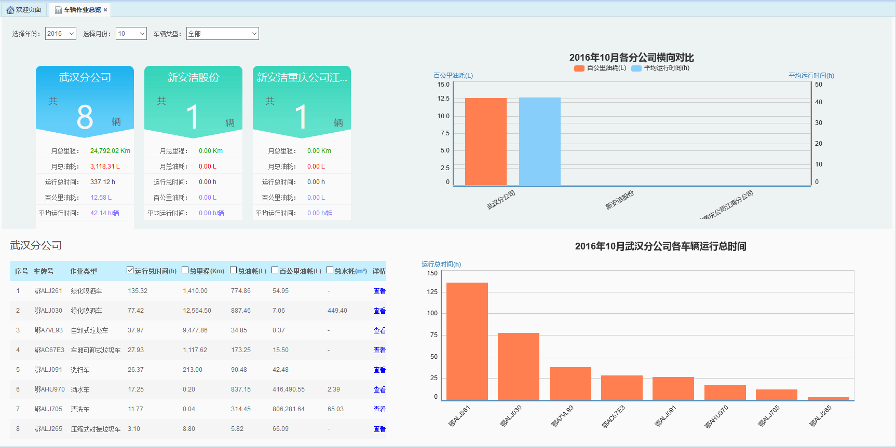
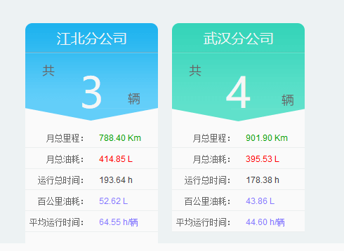
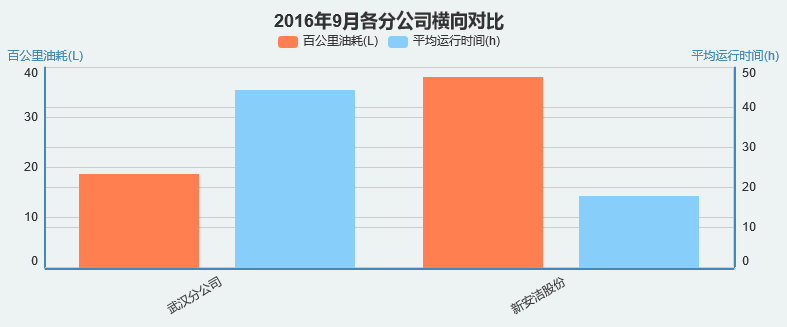
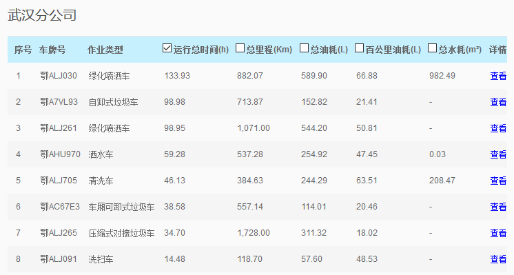
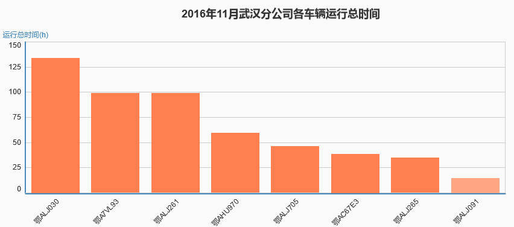

车辆作业总览是对所属公司下的全部车辆信息的整体情况的展示，可选择不同月份，不同类型车辆进行统计查看。展示的内容主要包括：各分公司车辆整体情况信息卡，各分公司信息横向对比柱状图，分公司车辆数据表，以及分公司各车辆数据横向对比柱状图。
 
图 3.4 17车辆作业总览界面
注意：该模块根据用户所属公司级别的不同，看到的信息也会不同，用户所处公司的级别越高，看到的信息越全面。

* **各分公司车辆整体情况信息卡**

	主要展示各分公司各类型或全部车辆的数量、月总里程、月总油耗、运行总时间、百公里油耗和平均运行时间。其中，运行总时间为所有车辆当月的运行总时间之和。
 

	图 3.4 18各分公司车辆整体情况信息卡

* **各分公司信息横向对比柱状图**

	该柱状图展示的是各分公司的平均百公里油耗及平均运行时间等数据的对比，点击图例可控制该数据的展示与关闭。
 

	图 3.4 19各分公司信息横向对比柱状图

* **分公司车辆数据表**

	该部分主要展示分公司内每一辆车的运行总时间、总里程、总油耗和百公里油耗等具体数值。点击某一分公司的信息卡片，即可显示出该分公司的车辆数据，如下图所示，其中，勾选不同类型的数据，可控制表格右侧柱状图的展示内容。点击“查看”链接，可直接跳转至【车辆作业详情】模块，查看该车当月的日均数据。
 

	图 3.4 20分公司车辆数据表

* **分公司各车辆数据横向对比柱状图**

	该部分是通过柱状图的方式对数据的展示，随着数据表中勾选的内容的变化而变化。
 

	图 3.4 21分公司各车辆数据横向对比柱状图
