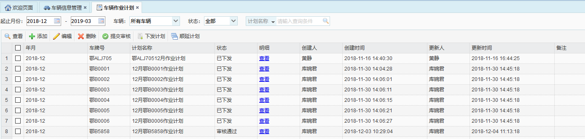

 车辆作业计划主要是机械主管针对不同的作业路段，添加作业计划，制作计划明细，提交给生产主管进行审核，审核通过后下发计划。计划下发后，作业人员和巡查员即可查看与自己相关的作业计划。在app端和车载app端都会同步显示。
计划的五种状态：未审核、审核中、审核通过、审核失败、已下发。
车辆作业计划模块主要是对每辆车辆制定月计划，并对车辆的月计划进行提交和下发的管理，包括对车辆计划进行查看、添加、编辑、删除、提交审核，下发计划以及顺延计划等功能。

* **添加作业计划**
             选中一条车辆数据，点击【添加】按钮，弹出添加作业计划对话框，在添加作业计划对话框中选择月份，输入备注，点击【保存】按钮即可。

* **查看作业计划**
             选中一条车辆数据，点击【查看】按钮，弹出查看作业计划对话框，  即可查看该车辆计划的基本信息。

* **编辑作业计划**
             选中一条车辆数据，点击【编辑】按钮，弹出编辑车辆作业计划对话框，即可对该车辆作业计划的备注进行编辑。其中，年 月是无法编辑的。
备注：只能编辑状态为‘未审核’或‘审核失败’的作业计划。

* **删除作业计划**
             选中一条车辆数据，点击【删除】按钮，弹出确认框，点击【确定】按钮，即可删除该条车辆作业计划。
备注：只能删除状态为‘未审核’的作业计划。
* **提交审核**
选中一条车辆数据，点击【提交审核】按钮，弹出“提交审核成功”提示框。
备注：只能提交状态为‘未审核’或‘审核失败’的作业计划。

* **下发计划**
             选中一条车辆数据，点击【下发计划】按钮，弹出“下发成功”提示框。
备注：只能下发状态为‘审核通过’的作业计划。

* **顺延计划**
             选中一条车辆数据，点击【顺延计划】按钮，弹出“顺延成功”提示框。
备注：只能顺延状态为‘已下发’或‘审核通过’的作业计划。

