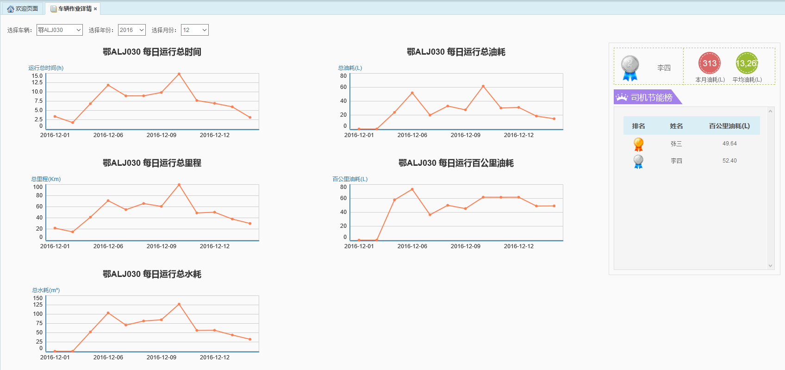
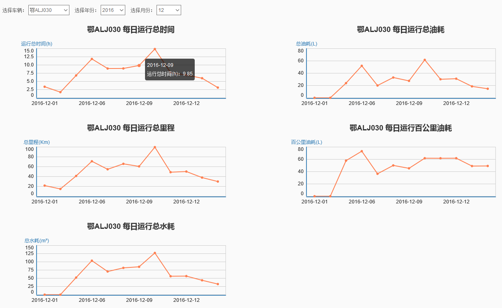
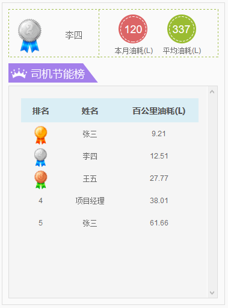

车辆作业详情是对每一辆车的详细信息的展示，采用折线图的方式进行展示。展示内容包括：运行总时间、总油耗、总里程、百公里油耗等。此外，还根据车辆的百公里油耗情况对车辆所绑定的司机进行评定及排名。
 

图 3.4 22车辆作业详情界面

* **月数据展示折线图**

	该部分主要通过折线图的形式展示该车当月的日平均数据，包括以下数据：每日运行总时间、总油耗、总里程、百公里油耗及总水耗。鼠标移至折线点上可查看具体日平均数值。
 

	图 3.4 23月数据展示折线图

* **司机节能榜**

	该部分是对司机的油耗情况的评断以及司机所处的排名情况，可作为司机当月绩效的评判标准之一。其中，平均油耗为该月当前可查询到的有数据的车辆的油耗之和除以车辆数。
 
 
	图 3.4 24司机节能榜
