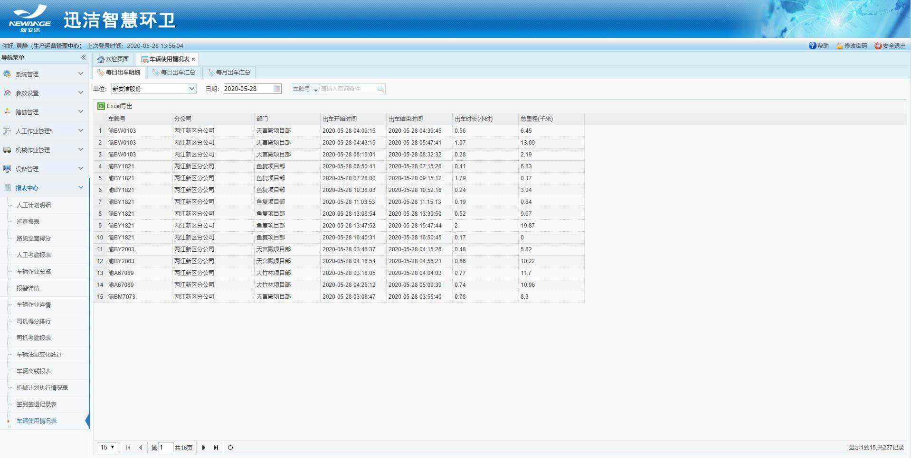

## 车辆使用情况表
1. 展示所有安装了立宇泰车载终端的车辆的出车记录；
2. 分3张表：每日出车明细、每日出车汇总、每月出车汇总；
3. 每张表都可以根据单位进行筛选、并且可以Excel导出；
4. 每日出车明细展示车辆每日ACC开启和关闭的时间、期间的时长、里程；
5. 每日出车汇总展示车辆每日每次ACC开启关闭的总时长和总里程，可以查看车辆明细；
6. 每月出车汇总统计车辆当月出车总时长和总里程，也可以查看日汇总；
7. 车辆启动到熄火时间间隔超过10分钟视为一个时间段，少于10分钟，日明细里不会有记录。
