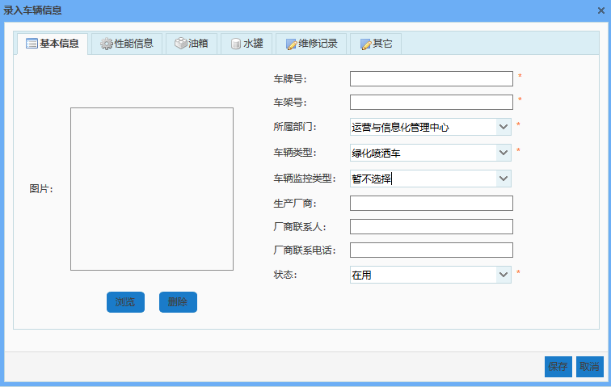
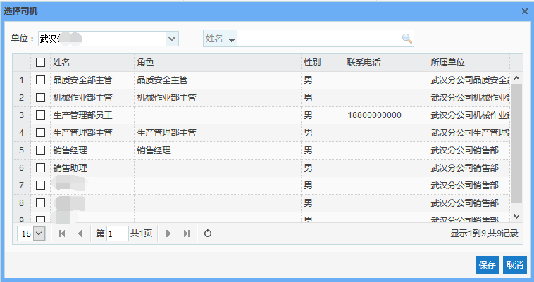

车辆信息管理模块主要是对车辆详细信息和维修记录的管理及车辆司机的分配，包括车辆信息的查看、添加、编辑、删除、司机的选择、绑定时段以及Excel导出。
 
图 3.4 4车辆信息管理界面

* **添加车辆信息**

点击【添加】按钮，弹出录入车辆信息对话框，需要录入的车辆信息分为五类：基础信息、性能信息、油箱、水罐、维修记录及其他，输入相关信息后，点击【保存】按钮，即可成功添加车辆信息。
其中，油箱和水罐中输入的是其容量相关的参数。当车辆安装了水位探测仪或油位探测仪后，只有在油箱或水罐中输入了参数，方可获取到该车的油耗及水耗数据。
由于油箱和水罐的标称容量往往远小于实际最大容量，因此强烈建议不填写标称容量，只填写油箱和水罐的实际测量得到的尺寸。
 

	图 3.4 5添加车辆信息

* **查看车辆信息**

    选中一条车辆数据，点击【查看】按钮，弹出查看车辆信息对话框，下拉滚动条，即可查看该车辆全部信息和维修记录。
    
* **编辑车辆信息**

	选中一条车辆数据，点击【编辑】按钮，弹出编辑车辆信息对话框，即可对该车辆信息进行编辑。其中，修改所属部门时，下拉单位树中只能选择部门，非部门下无法保存，且当修改后的所属部门与当前用户所在部门不在同一公司下时，该车辆信息将不再显示在当前列表中。

	图 3.4 6编辑车辆信息

* **删除车辆信息**

	选中一条车辆数据，点击【删除】按钮，即可删除该车辆信息数据。

* **选择司机**

	选中一条车辆数据，点击【选择司机】按钮，弹出选择司机对话框，在对话框中找到该车所属的司机，选中该司机信息，点击【保存】按钮，即可完成该车辆的司机指派工作。
若需要修改该车辆的司机，同样点击【选择司机】按钮，选中需要更改的司机信息即可。
若需要取消该车辆绑定的司机，在选择司机对话框中取消该司机的选中后保存，即可取消司机的绑定。
 

	图 3.4 7选择司机

* **绑定时段**
 选中一条车辆数据，点击【绑定时段】按钮，弹出选择时段对话框，选择一个或多个时段点击确定。
绑定时段的目的：每一辆车都必须制定它的月工作计划，由于每辆车每天的工作时段不一样，绑定了时段后，制作计划明细就有了对应的工作时间。
* **Excel导出**
             选中查询出的数据，点击【Excel导出】按钮，可对查询出的数据以Excel的形式导出。
