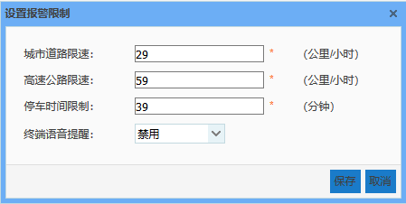

车辆报警设置是对报警类型的限制进行设置的模块，包括对报警限制阈值的设置和报警类型优先级的设置。
目前系统中已有报警类型包括：车辆超速、车辆越界和车辆停车超时，当出现以上报警时，实时定位中可实时接收到报警通知，轨迹回放中可查询到相应的报警信息，并可进入轨迹回放中查看该报警信息所在位置。

* **设置报警限制**

	直接点击【设置报警限制】按钮，即可对已有报警限制进行设置。
城市道路限速：当车辆在城市道路上运行速度超过该值时，发出报警信息；
高速公路限速：当车辆在高速公路上运行速度超过该值时，发出报警信息；
停车时间限制：当车辆在线停车时间超过该值时，发出报警信息。

 
 图 3.4 8设置报警限制
	其中，车辆越界的限制可通过电子围栏模块进行设置。
    

* **优先级调整**
    当同一时间车辆出现多种类型报警时，实时定位中优先显示优先级较高的报警信息。可直接在列表中拖动报警信息，即可调整报警类型的优先级，其中，优先级为1时即表示优先级最高。

* **终端语音提醒，有启用和禁用两个状态**
表示车载终端在车里出现报警时，会不会语音播报提醒，如：车辆超速、车辆超时停车、车辆越界。
