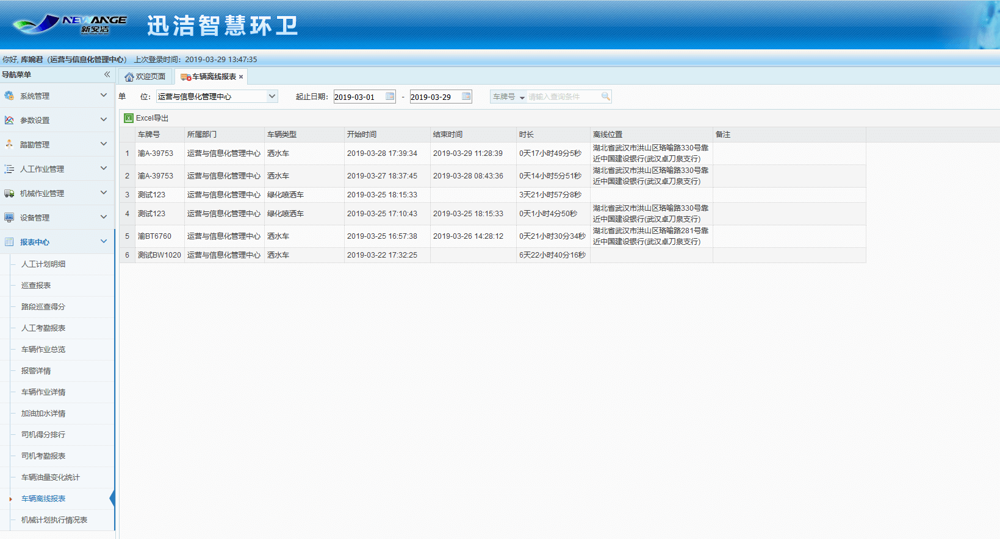

车辆离线报表统计的是车载终端异常掉线情况。与其匹配的迅洁数据采集服务app是4.1版本及以上，以下版本正常离线情况也会被统计（因为acc关闭，则不发送心跳，现在改成与acc无关，任何时候都发送心跳）。车辆从离线（迅洁数据采集服务持续5分钟没有发送心跳，app异常崩溃）那一刻起，报表数据显示会有10-15分钟的延迟，如果车辆离线时间小于10分钟，则不会产生离线记录。超过10分钟才有记录

             
1. 可根据离线开始时间进行筛选，也可根据部门、车牌号和车辆类型进行搜索。