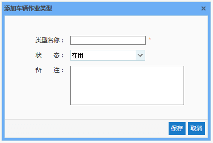
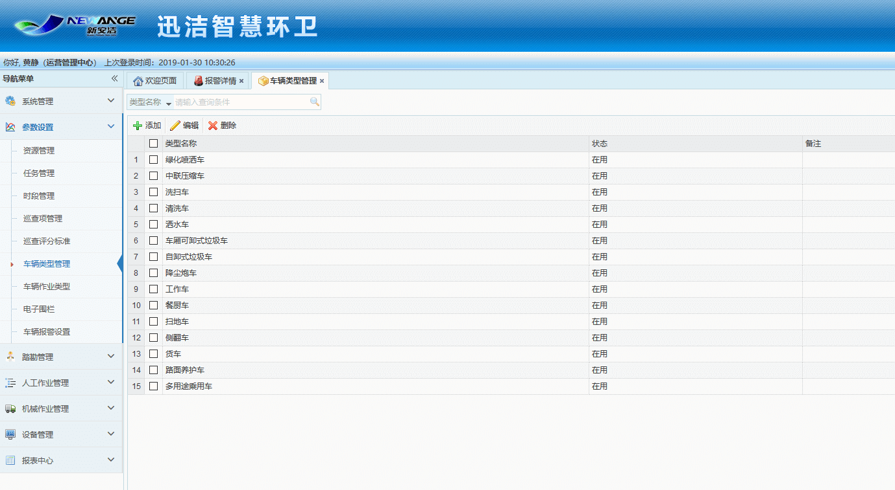

车辆类型管理主要是对作业车辆的添加、编辑及删除。该模块中添加的车辆作业类型在整个系统中都将通用，例如：垃圾收运车、洗扫车、绿化喷洒车、自卸式垃圾车等。
* **添加车辆作业类型**

	点击【添加】按钮，弹出添加车辆作业类型对话框，输入相应信息，点击【保存】按钮，即可实现车辆作业类型的添加。
注意：输入框后带有“ * ”的表示必填信息，如不填写则无法进行保存。
 
 
   图 3.4 3添加车辆作业类型
   
* **编辑车辆作业类型**

	选中一条需要进行修改的车辆作业类型数据，点击【编辑】按钮，弹出编辑车辆作业类型对话框，对相应信息做出修改后，点击【保存】按钮，即可完成对车辆作业类型信息的编辑。
    
* **删除车辆作业类型**

	选中一条需要删除的车辆作业类型数据，点击【删除】按钮，即可删除该车辆作业类型数据。

