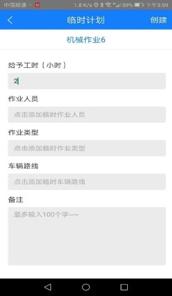

机械作业主管登录迅洁app，进入车辆计划，可以根据部门进行筛选查询相应的作业计划。点击筛选，筛选部门，选中部门，如图2，显示当前车辆的当月的作业计划。点击日期，查看计划详情可以查看当前日期的计划详情。点击不同的日期，则显示不同日期的计划详情。

* **新建临时计划**
             只能对还未开始的作业计划新建临时计划。
点击编辑，选择要建临时计划的计划明细，点击新建，如图2，输入给予工时，选择作业人员、作业类型、车辆路线和备注，点击创建，如图3，计划明细里多出一行临时计划。

             临时计划创建成功之后，项目经理会收到一条消息：××人员新建了临时计划。