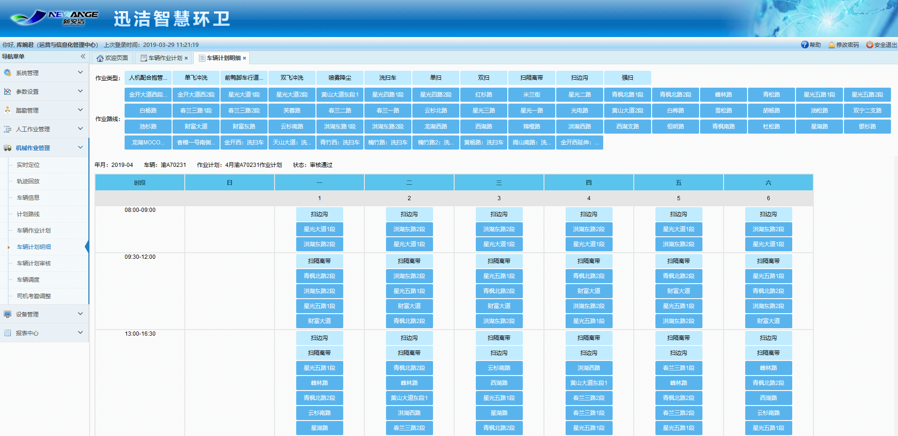
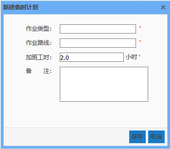

 车辆计划明细只能通过车辆作业计划的新建或查看按钮跳转。该页面主要显示该车辆该月的计划明细，什么时间段按照哪条路线执行什么任务。
车辆计划明细的制定方法和人工计划一样，通过拖动作业类型、作业路线到日历的相应时段内，如果后续每天的计划都和今天的一样，就可以选择顺延，输入顺延天数可以快速顺延至当月最后一天。

             
注意：计划明细每天的计划都要排满，否则计划无法提交审核
 计划下发后，可以取消未执行的计划，如果出现人员请假或调动，可以提前新建临时计划，改动作业路线、作业类型，拟定加班小时。新建临时计划后，也可对临时计划进行查看和编辑。
在迅洁app端，车辆计划中管理员会收到一条消息推送：某某新建了××车辆的临时计划。
