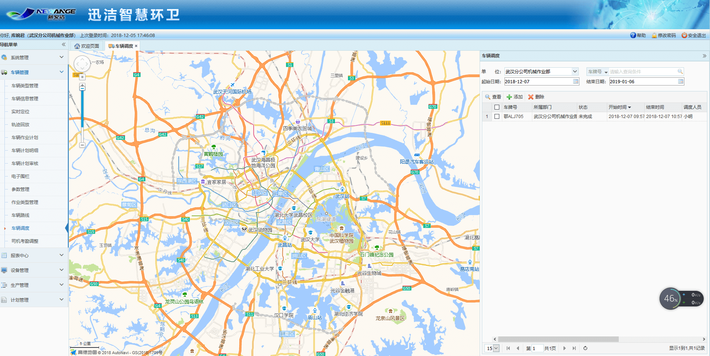
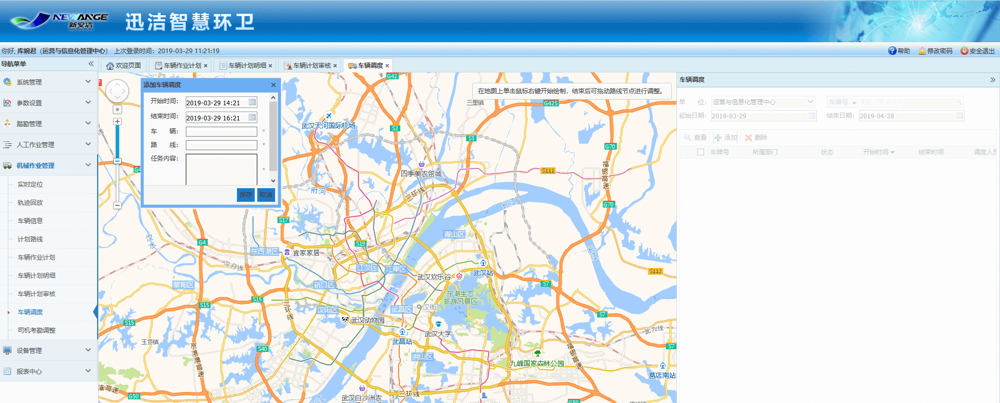

  车辆调度是出现紧急情况临时调动车辆、并且制定路线和时间，来处理紧急情况，指挥需要处理临时任务的车辆，对调度车辆实现查看、添加、删除功能。
在app端和车载app端都会同步显示。
调度的四种状态：待完成，进行中，已完成，已过期。
创建完车辆调度后，车辆调度的状态为待完成.
在时段内，点击开始作业，车辆调度的状态为：进行中.
在时段内，点击结束作业，车辆调度的作业为：已完成.
在创建的时段已过去时，车辆调度的状态为：已过期。
   
* **添加车辆调度**
             点击【添加】按钮，地图区域中弹出添加作业路段对话框。
在地图左上角的输入框中，点击输入框，可以选择司机、时间、车辆、路线和任务内容，点击【保存】按钮，即可完成车辆调度的添加。
注：路线是可以选择制定路线，也可直接绘制临时路线。

* **查看车辆调度**
             右侧列表中选中一条需要查看的车辆调度数据，点击【查看】按钮，该车辆路线以绿色的形式展现在地图中心区域，查看车辆调度对话框中显示该车辆调度相关信息。
点击查看车辆路线对话框右上角的关闭按钮，即可退出查看。只有退出查看状态后，才可进行其他操作。
* **删除车辆调度**
             右侧列表中选中一条需要删除的车辆调度数据，点击【删除】按钮，即可删除该车辆调度数据。
