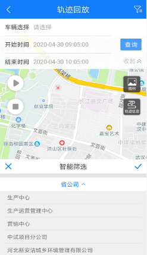
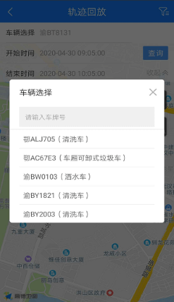
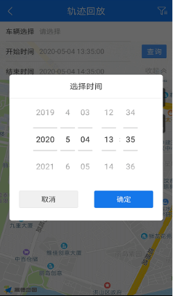
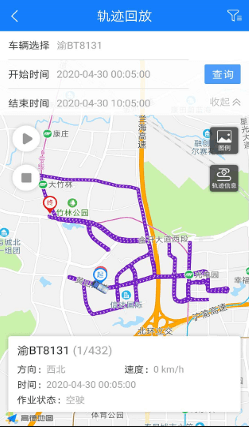
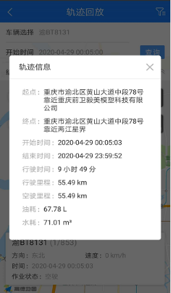
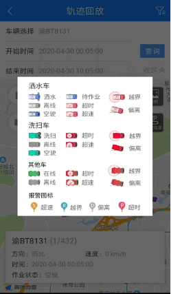

## 轨迹回放
轨迹回放是对某一车辆指定时间内的轨迹信息进行查看，并模拟该车辆该段时间内的运行轨迹。
  
* 筛选部门：选择要查看的车辆所在的部门。
点击右上角的筛选按钮，弹出智能筛选框，依次选择省公司、分公司、部门。
* 选择车辆：在输入框里输入车牌号，可以快速检索到该车辆

* 开始时间：默认为当前时间倒推一小时；结束时间：默认是现在。也就是默认展示1个小时的轨迹，也可以手动选择其他任意时间段进行查询。
* 播放和停止：点击地图按钮播放，可以看到车辆按照历史轨迹进行还原。点击停止则车辆停止播放并还原至起点位置。

* 轨迹信息：展示该车辆在指定时间段内的起点位置、终点位置、行驶时间、行驶里程、空驶里程、油耗、水耗。
* 图例：不同类型的车辆及不同作业状态下的车辆在地图上展示对应的图标，辅助看懂地图上的车辆小图标。

