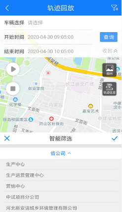
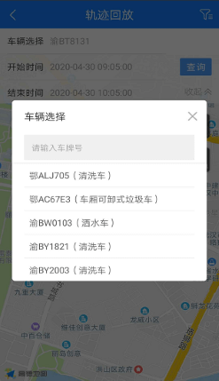
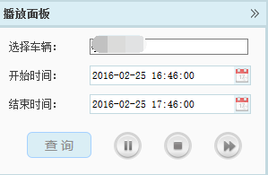
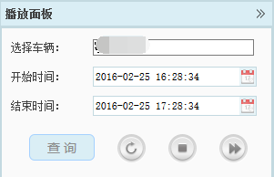
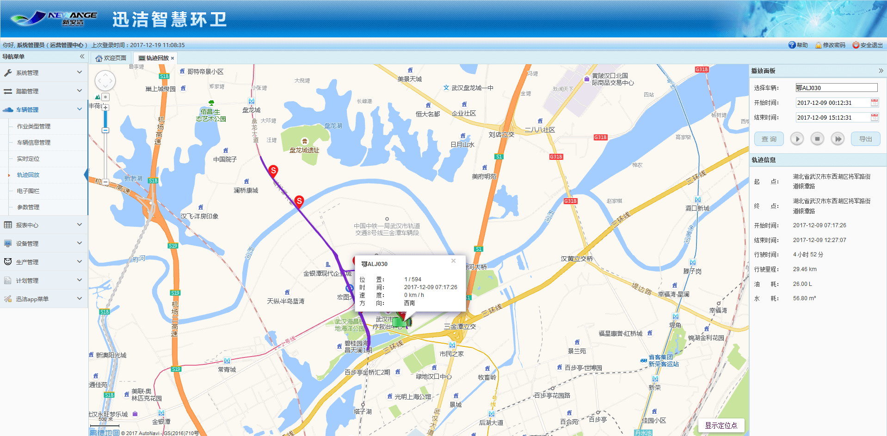
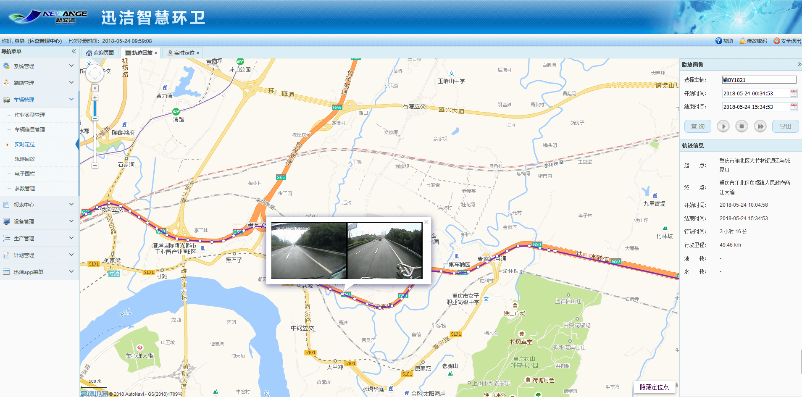
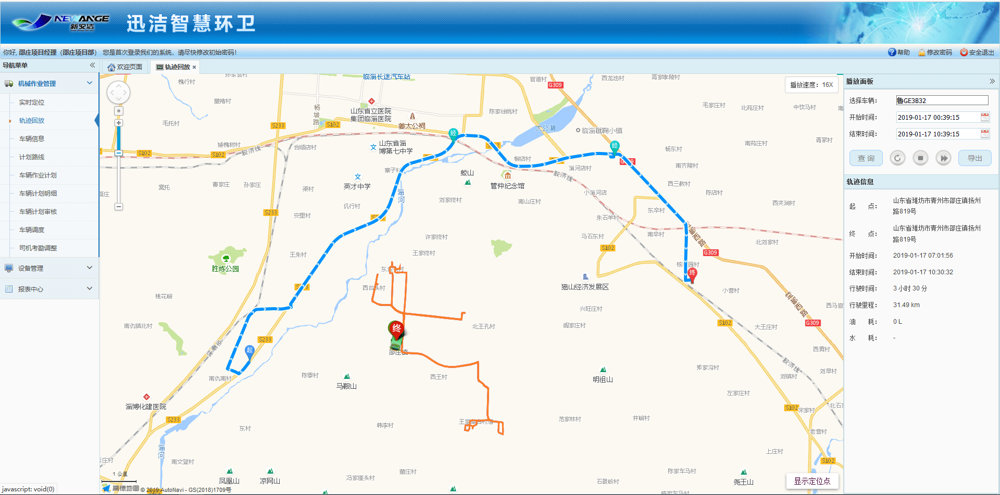

轨迹回放是对某一车辆指定时间内的轨迹信息进行查看，并模拟该车辆该段时间内的运行轨迹。操作方法如下：

* **查询轨迹**
在播放面板中，点击选择车辆后的输入框，即弹出“选择车辆”对话框，在该对话框中选择需要查看轨迹信息的车辆，点击【确定】按钮，选择车辆输入框中显示已选择的车辆的车牌号。开始时间与结束时间默认为最近一小时，可根据需要查询的时间进行调整，但开始时间和结束时间只能在同一天。调整好查询时间后，点击【查询】按钮，若该段时间内，该车辆一直处于离线状态，则提示“无可用数据”，若该段时间内，该车辆处于运行状态，则地图中将绘制出该车辆的运行轨迹，并标明起点及终点位置。轨迹信息与车辆状态栏中也将显示出相应信息。
其中，当查询当天的轨迹时，轨迹信息中不展示油耗及水耗数据。

             
图 3.4‑10查看轨迹
* **轨迹回放**
查询出轨迹信息后，点击播放 按钮，则地图中的作业车辆将以原始车辆的8倍速率进行移动且车辆头上气泡会跟随车辆移动；点击 播放按钮，作业车辆停止在当前位置，再次点击播放 按钮，作业车辆继续移动；点击 停止按钮，作业车辆回到起点；车辆移动过程中，点击加速播放 按钮，可调整作业车辆移动的速率；作业车辆移动至终点后，点击播放 按钮，即可重新播放。

             图 3.4‑11播放面板

* **查看报警信息**
若查询的轨迹中，出现过车辆超速、车辆超时停车和车辆越界等报警时，会在轨迹中出现报警的位置标记出来，同样，图标中的字母S为车辆超速，P为车辆停车超时，R为车辆越界。
点击该图标，会弹出车辆状态信息框，可查看该车在该点时的状态信息，包括时间、速度、方向、油量、水量、当前位置以及报警信息。

             
图 3.4‑12报警信息展示界面
* **显示定位点**
查询出轨迹后，右下角会出现显示定位点的开关，滚动鼠标，放大地图后，鼠标点击轨迹上的定位点即可显示该定位点上，车辆拍摄的照片。

* **计划路线与实际路线做对比**
             如果该车辆有已经下发的计划，则地图上会同时显示该车辆的计划路线与实际路线。

