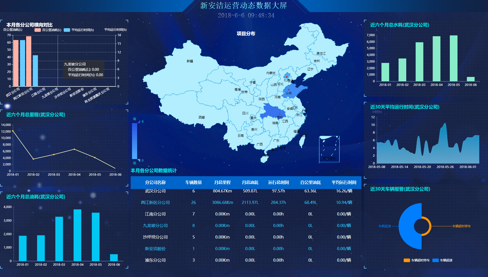
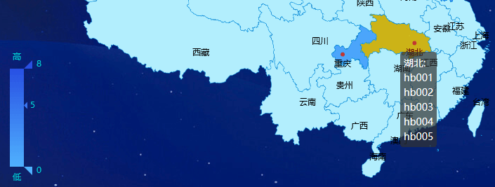
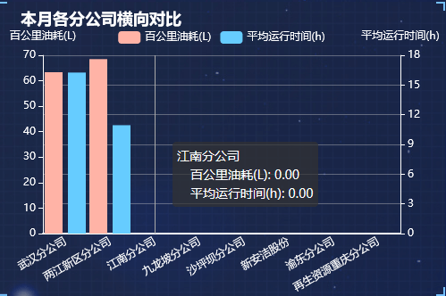

运营动态数据大屏，主要提供给公司的管理人员实时查看公司的运营动态，展示最新的数据。系统根据当前登录用户所在的分公司，来展示相对应的运营动态公司的数据。（当前登录用户所在部门的上一级公司），另外，该数据大屏不会因为用户的退出登录而自动关闭。
分为8个区域，大屏**中上**的地图部分：项目分布图；
**中下**为：本月各个分公司的车辆数据统计；
**左上**角：本月各分公司横向对比；
**左中**：近6个月的总里程；
**左下**角：近6个月的总油耗；
**右上**角：近6个月总水耗；
**右中**：近30天平均每辆车的运行时间；
**右下**角：近30天车辆的报警情况。
##  1. 项目分布图
在地图上展示公司现有的所有的生产项目，有项目的省份背景颜色是蓝色，颜色的深浅会根据当前省份的项目个数而变化，项目越多，背景颜色越深，8个或8个以上颜色达到最深，不会再变化。地图上有气泡轮回展示各个省份的项目名称。注意：项目分布图不会根据当前登录用户的分公司来确定展示的内容，也就是所有用户登录所看到的项目分布图均显示一致。（地图上红色的点只对项目所在的位置进行粗略的定位，也就是湖北省各大市区无论分布了多少个项目，红色的定位点永远只定位在一个位置上。并且地图可以滚动鼠标进行无限放大，由于该地图属于省份地图，地图都不会定位的市和区，也就是仅仅是图片的放大而已。还可以拖拽地图，移动位置。）当鼠标移动到有项目的省份时，省份背景变成黄色，气泡固定不再轮回，且地图左下角自动定义到项目的个数及背景颜色

##  2. 本月各公司横向对比
 
  主要显示：本月各个分公司的百公里油耗和平均运行时间的柱状对比图
##  3. 剩下的5张报表
平均30s 变换一家分公司，显示同一个分公司的不同数据：近六个月总里程、近六个月总油耗、近六个月总水耗、近30天平均运行时间、近30天车辆报警（面积图）
