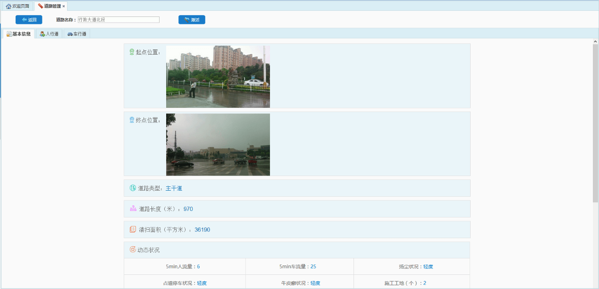

道路管理主要是对道路进行添加、编辑、删除、指派踏勘人以及查看踏勘结果等操作。直接进入【道路管理】模块时，需点击选择项目后面的输入框，选择一个需查看道路的项目，或在【项目管理】模块中，找到相关项目，点击项目后的“查看道路”链接，即可进入该项目的道路管理页面。

* **添加道路**
点击【添加】按钮，弹出添加道路对话框，输入相关信息，即可成功添加道路信息。其中，所属项目默认为当前选中的项目。

* **指派踏勘人**
选中一条道路数据，点击【指派踏勘人】按钮，弹出指派踏勘人对话框，选择需要指派的踏勘人，点击【保存】按钮，即可为该条道路指派踏勘人。若需修改踏勘人，同样点击该按钮，选择其他用户即可。
注意：只有在道路处于【未踏勘】状态下时才可指派或修改踏勘人，被指派的踏勘人登录迅洁APP后，将在【我的任务】页面，看到该条道路的踏勘任务。

* **编辑道路**
选中一条数据，点击【编辑】按钮，弹出编辑道路对话框，即可对该道路信息进行编辑。
* **删除道路**
选中一条数据后，点击【删除】按钮，即可删除该道路数据，包括道路信息及踏勘结果。
* **查看踏勘结果**
选中一条状态为“未踏勘”的道路，点击【查看踏勘结果】按钮，提示“该道路尚未开始踏勘”。
选中一条状态为“踏勘中”的道路，点击【查看踏勘结果】按钮，页面切换至踏勘结果页面，可查看该条道路的踏勘数据。
但此时尚未完成踏勘，踏勘数据仅供参考。

图 3.3 9踏勘结果1
选中一条状态为“踏勘完成”的道路，点击【查看踏勘结果】按钮，页面切换至踏勘结果页面，可查看该道路的踏勘数据。
此时数据为踏勘完成后的数据，若该数据存在问题，可点击【激活】按钮，将道路状态激活为“未踏勘”，踏勘人需再次进行踏勘；若踏勘数据无误，可点击【确认】按钮，道路状态变为“已确认”，表示该道路踏勘结果符合要求。

图 3.3 10踏勘结果2
选中一条状态为“已确认”的道路，点击【查看踏勘结果】按钮，页面切换至踏勘结果页面，可查看该道路的踏勘数据。若该数据存在问题，仍可点击【激活】按钮，将道路状态激活为“未踏勘”，踏勘人可重新开始踏勘。

图 3.3 11踏勘结果3
