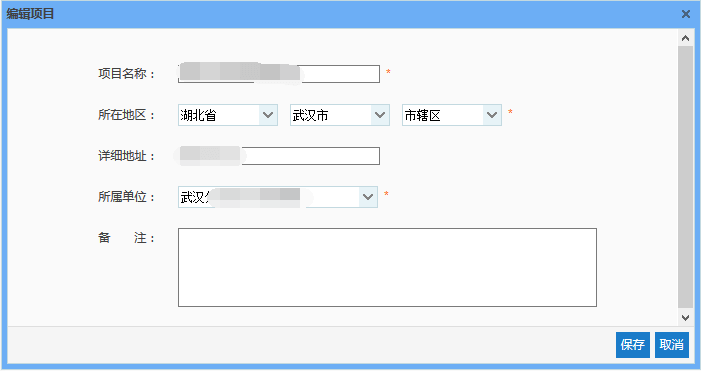
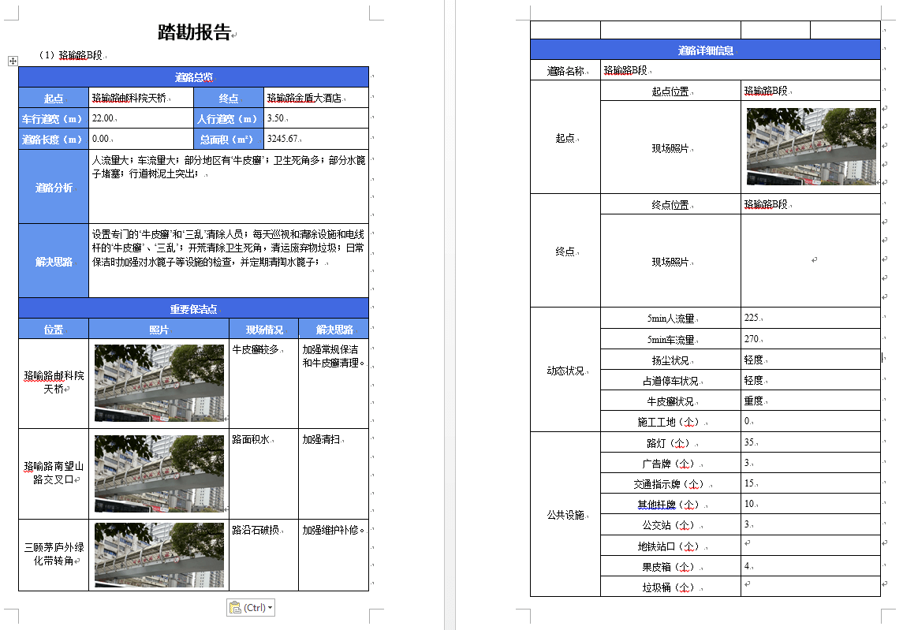

项目管理包括编辑项目、删除项目和导出项目踏勘报告，生产主管无法添加项目，项目来自于销售经理的指派。
* **编辑项目**
根据实际生产过程中的需要来对项目信息进行修改时，我们可以使用此功能。可修改信息包括：项目名称、所在地址、详细地址、所属单位以及备注。其中，更改所属单位时，只能选择部门，非部门下无法保存。当所属部门发生变化时，该项目将不再属于当前部门，因而列表中不再显示该项目信息。
注意：输入框后带有“ * ”的表示必填信息，如不填写则无法进行保存。

* **删除项目**
选中一条项目数据，点击【删除】按钮，即可实现对该项目的删除。但是需要注意的是，当项目下存在对应道路时，该项目是无法删除的，这样做是为了防止将正在使用的项目误删了。如果想要删除带有道路信息的项目，可以先去道路管理中删除相关的道路，然后再回来删除项目即可。
* **导出踏勘结果**
当一个项目下的所有道路踏勘完成后，我们可以使用此功能，自动将所有道路的踏勘结果汇总并导出为word文档，该功能操作方式如下：
选中一个项目，点击【导出踏勘结果】按钮，若该项目中存在踏勘未完成的道路，提示“道路踏勘尚未完成，无法导出踏勘报告”，若该项目中所有道路均踏勘完成，即道路状态均为“踏勘完成”或“已确认”，将直接进入下载页面，保存该文件即可。
踏勘报告分为3部分：道路总览、重要保洁点以及道路详细信息。且道路总览中会根据踏勘结果对每一条道路进行道路分析，并给出解决思路。

图 3.3 4踏勘报告
