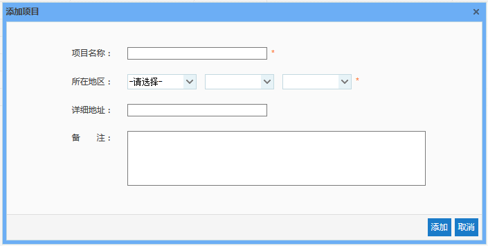
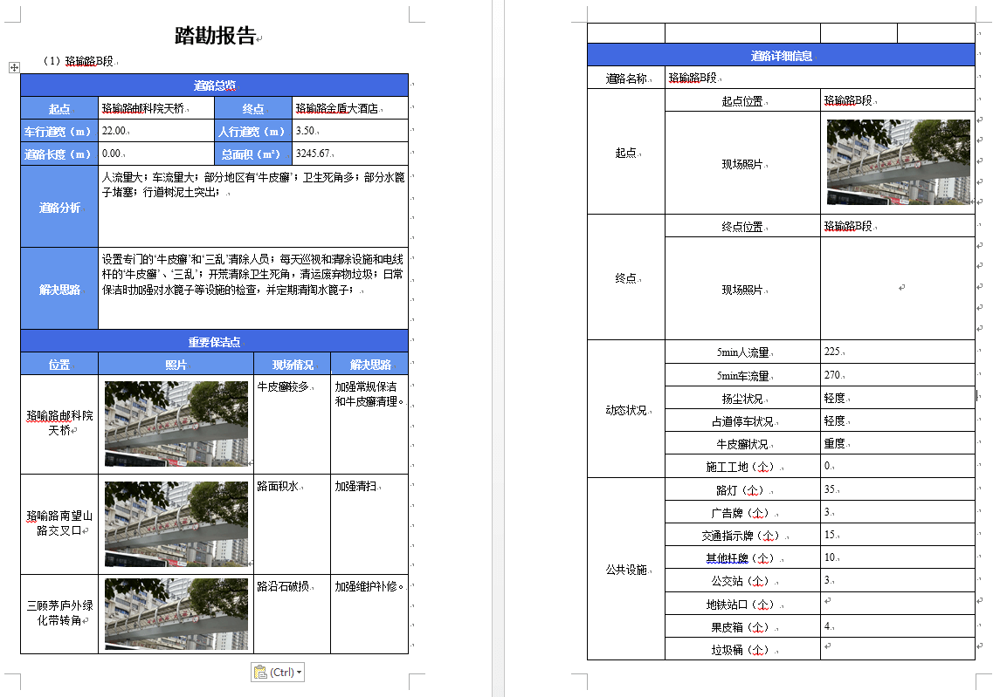
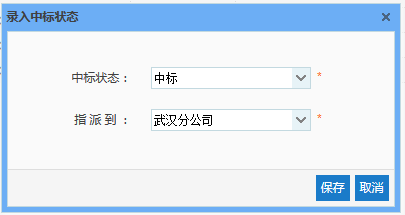
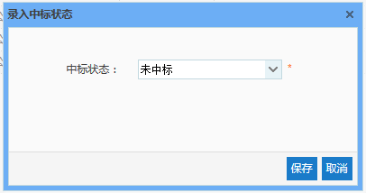

项目按照招投标状态分为3类，分别是：投标中、已中标和未中标。【已中标】和【未中标】标签页中只能查看相应状态的项目，【投标中】标签页中则可以对该状态下的项目进行管理，包括添加项目、编辑项目、删除项目、导出项目踏勘报告，以及录入项目中标状态，分别对应下图中各个按钮。

图 3.2 4项目管理界面
由于【已中标】与【未中标】标签页中的项目无特殊操作，以下介绍的均为【招标中】标签页中的项目的相关操作。
* **添加项目**
点击【添加】按钮，我们需要填入的信息分别是项目名称、所在地区、详细地址和备注，点击【保存】按钮，即可完成项目的添加。其中，项目所属单位默认为创建人所在的单位，所在地区与详细地址中输入的是项目实际所在地，而不是管理该项目的部门所在地。
注意：输入框后带有“ * ”的表示必填信息，如不填写则无法进行保存。
 
* **编辑项目**
编辑项目，可以修改在添加时填入的各种信息，当我们在添加项目时，录入了错误信息或者当项目信息需要更改时，我们就可以使用此功能对项目信息进行修改。可修改信息包括：项目名称、所在地址、详细地址、所属单位以及备注。其中，更改所属单位时，只能选择部门，非部门下无法保存。
* **删除项目**
删除项目，可以删除我们之前添加的项目，当我们添加了一个项目，但是后来发现它没有用了，我们就可以进行删除。
选择一条需要删除的项目数据，点击【删除】按钮，在弹出框中点击【确定】，即可完成删除操作。
但是需要注意的是，当项目下存在对应道路时，该项目是无法删除的，这样做是为了防止将正在使用的项目误删了。如果想要删除带有道路信息的项目，可以先去道路管理中删除相关的道路，然后再回来删除项目即可。
* **导出踏勘报告**
当一个项目下的所有道路踏勘完成后，我们可以使用此功能，自动将所有道路的踏勘结果汇总并导出为word文档，该功能操作方式如下：
在【项目管理】模块中，选中一个项目，点击【导出踏勘结果】按钮，若该项目中存在踏勘未完成的道路，提示“道路踏勘尚未完成，无法导出踏勘报告”，若该项目中所有道路均踏勘完成，即道路状态均为“踏勘完成”或“已确认”，将直接进入下载页面，保存该文件即可。
踏勘报告分为3部分：道路总览、重要保洁点以及道路详细信息。且道路总览中会根据踏勘结果对每一条道路进行道路分析，并给出解决思路。
 
* **录入中标状态**
录入中标状态是项目招投标过程中的最后一步，根据项目招投标结果选择合适的中标状态。在【项目管理】模块中，选中需要录入中标状态的项目，在弹出的录入中标状态对话框中，若选择“中标”，需将项目指派到相应的生产部门；若选择“未中标”，则不需指派部门。录入中标状态后的项目，将根据其中标状态，进入到相应的状态的标签页下，且处于【已中标】或【未中标】下的项目，只能查看项目中道路的踏勘结果，不可对其做任何修改。
    
