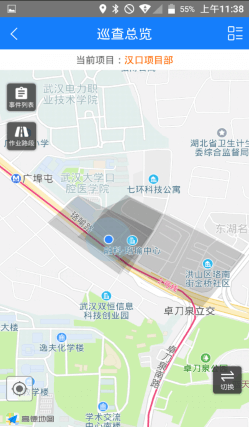
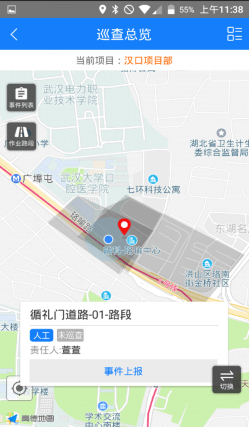
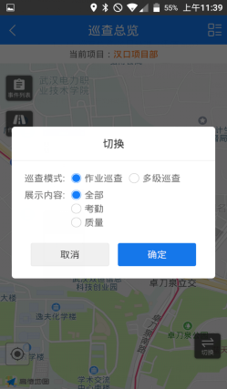

项目经理登录迅洁app，进入巡查总览，可以查看当前班组长巡查的最新结果，可以看到每个路段的评分标准，以及每个路段扫描到的作业人员
地图上：灰色路段表示未巡查，绿色表示巡查结果为优；橙色表示巡查结果为不合格；蓝色表示巡查结果为良；薄荷绿色表示巡查价格为合格。点击地图上的小人，可以查看他的信息，如图：作业人员的姓名、工牌、工牌电量及负责的路段，以及是否是计划匹配的人员。

注意：手机端的巡查总览可以查看不合格的照片，但是电脑端是可以查看的。

* 作业路段：地图左上角的作业路段图标，点击可以查看该路段的巡查结果
* 紧急事件：项目经理如果看到路段发生紧急事件，也可以进行上报。
